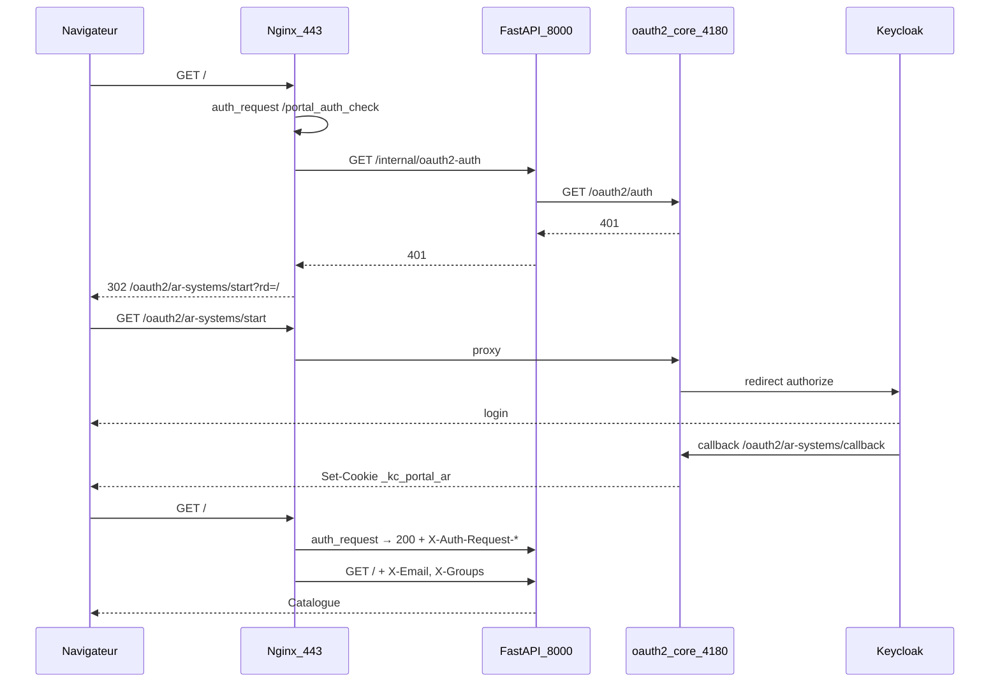
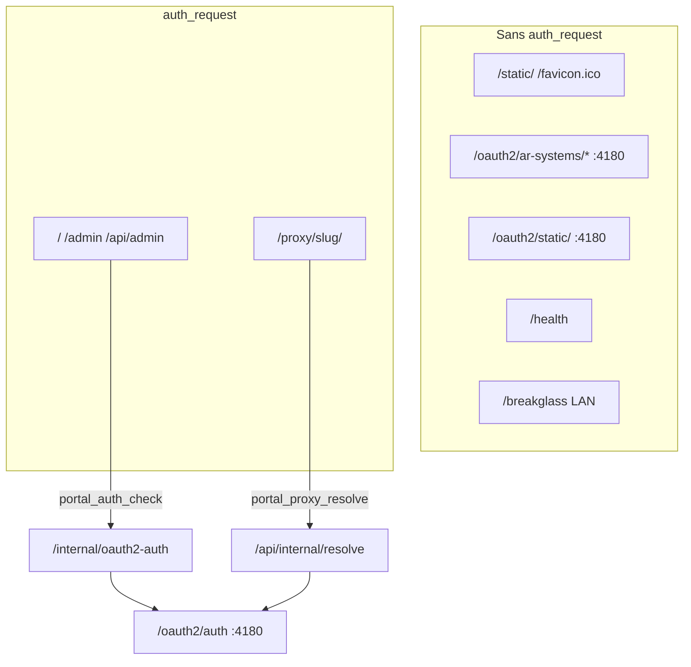

# Audit authentification — Portail SSO AR-Systems

> Document généré à partir du code du dépôt `awx-playbook` (`roles/sso_portal/`).  
> Date de référence : état post-purge DMZ `e56fa58` (juillet 2026).  
> **Architecture cible validée :** une seule instance `oauth2-proxy-core` sur `:4180` pour portail et admin.
>
> **Séparation DMZ :** linux_nginx_dmz.yml = infra seule ; portail/bastion = linux_sso_portal.yml ou dépôt applicatif.  
> **Spécifications normatives :** [docs/sdd/](sdd/README.md) — à jour pour figer le développement.  
> Ce document reste l’audit détaillé et l’historique des incohérences ; en cas de conflit, les SDD prévalent.

---

## Sommaire

1. [Cartographie des flux](#1-cartographie-des-flux)
2. [Incohérences et risques](#2-incohérences-et-risques)
3. [Architecture cible minimale](#3-architecture-cible-minimale)
4. [Hypothèses Keycloak](#4-hypothèses-keycloak)
5. [Fichiers sources](#5-fichiers-sources)

---

## 1. Cartographie des flux

### A. Accès utilisateur au portail `/`

| Question | Réponse (état repo) |
|----------|---------------------|
| Qui protège la route ? | **Nginx** (`auth_request`) puis **FastAPI** (`Depends(get_user_context)`) |
| Nginx ou FastAPI en premier ? | Nginx refuse ou autorise avant de proxyer vers FastAPI |
| Quel `auth_request` ? | `location = /portal_auth_check` (interne) |
| Chaîne complète | Nginx → `GET /internal/oauth2-auth` (FastAPI `:8000`) → `GET http://{realm.oauth2_listen}/oauth2/auth` (défaut `:4180`) |
| Endpoint oauth2-proxy public | `/oauth2/ar-systems/start?rd=<chemin-relatif>` sur redirection 401 |
| Headers transmis à FastAPI | `X-User`, `X-Email`, `X-Groups`, `X-Preferred-Username`, `X-Portal-Realm-Slug`, `X-Portal-Auth-Source`, `X-Portal-Internal-Token` |
| Comportement si non authentifié | Nginx reçoit 401 de la sous-requête → `error_page 401 = @portal_oauth2_signin` → `302 /oauth2/ar-systems/start?rd=$portal_oauth2_rd_safe` |

**Chemins publics (sans `auth_request`) :**

- `/health`, `/api/health`
- `/static/*`, `/favicon.ico` (alias vers logo.svg)
- `/auth/*` (entrée SSO FastAPI : `/auth/sso-start`, `POST /auth/login`)
- `/breakglass` (LAN RFC1918 uniquement)
- Tout `/oauth2/*` (proxy direct vers oauth2-proxy, pas d'auth_request Nginx)

**Séquence (utilisateur sans session) :**

**Fichiers :** `templates/nginx-portal.conf.j2` (L152–169, L273–294), `files/portal/app/main.py` (`/internal/oauth2-auth`), `files/portal/app/auth.py` (`get_user_context`).

---

### B. Accès admin `/admin`

| Question | Réponse |
|----------|---------|
| Qui protège Nginx ? | Même `auth_request /portal_auth_check` que `/` via `snippets/proxy_portal_admin_location.conf.j2` |
| Instance oauth2 utilisée | **oauth2-proxy-core `:4180`** (cookie `_kc_portal_ar`) — **pas** core-admin `:4190` |
| Qui détermine l'admin ? | FastAPI `require_admin` → `UserContext.has_admin_access(db)` |
| Groupe Keycloak | Intersection `X-Groups` avec `portal_admin_groups` (défaut `portal-admins`) |
| Admin local | Table `local_admins` (e-mail) → `local_admin=True` |
| Breakglass | JWT cookie `portal_breakglass_token` ; Nginx accorde 200 sur **présence** du cookie ; FastAPI valide le JWT |
| Codes attendus par Nginx (`auth_request`) | **200** = autorisé, **401** = redirection login |
| Codes interdits vers Nginx depuis `/internal/oauth2-auth` | **400**, **403**, **5xx** — Nginx transforme tout sauf 2xx/401/403 en **500** côté client |

**État actuel FastAPI `/internal/oauth2-auth` :**

| Condition | Code HTTP |
|-----------|-----------|
| Session oauth2 valide | **200** (+ headers `X-Auth-Request-*`) |
| Session absente / invalide | **401** |
| oauth2-proxy injoignable | **401** |
| oauth2-proxy répond 400/403/5xx | **401** (normalisé) |
| Jeton interne Nginx invalide | **403** (à corriger → 401) |
| Exception non gérée | **401** |

**Admin FastAPI après passage Nginx :** `require_admin` renvoie **403** JSON pour les
clients API. En navigation HTML, le handler global redirige un utilisateur authentifié
non admin vers **`/apps`** (page 403 HTML si non authentifié).

---

### C. Flux OIDC oauth2-proxy

| Élément | Valeur |
|---------|--------|
| URL start | `/oauth2/ar-systems/start?rd=/chemin-relatif` |
| URL callback | `https://portal.ar-systems.fr/oauth2/ar-systems/callback` |
| Cookie session | `_kc_portal_ar` |
| Cookie domain | `portal.ar-systems.fr` (instance core, domaine unique) |
| Cookie path | `/` |
| SameSite | `lax` |
| Expiration | 8h, refresh 1h |
| Cookie CSRF oauth2-proxy | `_oauth2_proxy_csrf` (nom par défaut oauth2-proxy v7) |
| `cookie_csrf_per_request` | **Absent** (volontaire — incompatible callback Keycloak) |
| `redirect_url` cfg | `https://portal.ar-systems.fr/oauth2/ar-systems/callback` |
| `client_secret` | Fichier `client_secret_file` (core) ; inline pour realms exportés |
| `reverse_proxy` | `true` |
| `skip_provider_button` | `true` |
| Provider | `oidc` → `https://keycloak.ar-systems.fr/realms/AR-SYSTEMS` |

**Où apparaissent 400 / 403 / 500 :**

| Code | Causes typiques |
|------|-----------------|
| **400** | `rd` URL absolue non whitelistée ; `redirect_url` Keycloak mismatch ; secrets vides dans `.cfg` ; cookie domain incorrect |
| **403** | CSRF state mismatch (double instance oauth2 4180/4181, cookies concurrents, `cookie_csrf_per_request`) |
| **500** | `auth_request` reçoit code hors 2xx/401/403 ; crash oauth2-proxy ; erreur Nginx upstream |

**Ports par instance :**

| Instance | Port | Statut cible |
|----------|------|--------------|
| `oauth2-proxy-core` (ar-systems) | 4180 | **Actif — unique pour portail + admin** |
| `oauth2-proxy-portal` (legacy) | 4181 | **Arrêté** |
| `oauth2-proxy-portal-ar-systems` | 4180/4181 | **Arrêté** (dedup) |
| `oauth2-proxy-portal-clients` | 4182 | Actif (realm clients) |
| `oauth2-proxy-core-admin` | 4190 | **À désactiver** |

---

### D. Logout

| Étape | Comportement |
|-------|--------------|
| Route portail | `GET /logout` (public côté FastAPI middleware ; Nginx avec `auth_request` + `error_page 401 = @portal_logout_anonymous`) |
| Breakglass | Suppression cookie `portal_breakglass_token` → redirect `/breakglass` |
| SSO | Front-channel Keycloak : `.../protocol/openid-connect/logout?client_id=sso-portal-ar-systems&post_logout_redirect_uri=...` |
| `post_logout_redirect_uri` | `https://portal.ar-systems.fr/oauth2/{slug}/sign_out?rd=/` |
| oauth2-proxy | `/oauth2/{slug}/sign_out` efface cookies locaux → redirect accueil |
| Cookie realm | Suppression `portal_realm_slug` |

**URIs Keycloak requises** (`realm_service.compute_keycloak_client_urls`) :

- `redirect_uris` : `https://portal.ar-systems.fr/oauth2/{slug}/callback`
- `post_logout_redirect_uris` : `https://portal.ar-systems.fr/`, `https://portal.ar-systems.fr/oauth2/{slug}/sign_out`, URL complète sign_out

---

### E. Breakglass

| Élément | Détail |
|---------|--------|
| Route | `GET/POST /breakglass` |
| Accès réseau | LAN uniquement (127.0.0.0/8, 10.0.0.0/8, 172.16.0.0/12, 192.168.0.0/16) |
| Contournement Nginx | Pas d'`auth_request` sur `/breakglass` |
| Cookie | `portal_breakglass_token` (JWT, 8h) |
| Validation FastAPI | `user_context_from_breakglass` vérifie signature JWT |
| Validation Nginx auth_request | **Présence cookie seule** → `return 200` (pas de validation JWT) |
| Droits | Tous les groupes `portal_admin_groups` injectés ; `auth_source=break-glass` |
| Risque | JWT expiré : Nginx autorise encore la sous-requête auth ; FastAPI renvoie 401 sur routes protégées sans redirect SSO cohérent |

---

### F. Apps proxy transparent `/proxy/{slug}/`

| Élément | Détail |
|---------|--------|
| Protection Nginx | `auth_request /portal_proxy_resolve` |
| Backend auth | `GET /api/internal/resolve?slug=` (FastAPI) |
| Autorisation | RBAC : admin ou `user_can_see_app(entity, groups)` |
| Session SSO | Sous-requête vers `http://{realm}/oauth2/auth` ; accepte 200 ou **202** |
| Upstream | Headers `X-Backend-Url`, `X-Backend-Host`, `X-Remote-User`, `X-Strip-Prefix` |
| Rate limit | `limit_req_dry_run on` + clé vide → pas de blocage 429 |
| Impersonation Vault | `GET /api/internal/impersonate/{slug}` : login robot CrushFTP via `UserAppCredential` chiffré Fernet |

**Asymétrie :** `/api/internal/resolve` accepte oauth2 **202** ; `/internal/oauth2-auth` mappe 202 → 401.

---

### G. Apps vhost dédiées (`nginx_sso`)

| Mode | Protection |
|------|------------|
| `sso_mode: none` / catalogue | `vhost-app.conf.j2` : proxy direct, **pas** d'auth Nginx |
| `sso_mode: nginx_sso` | `nginx_enforcement.py` génère snippet `auth_request /oauth2/auth` **direct** vers upstream oauth2 (pas via FastAPI) |
| Risque | Cookie/port oauth2 divergent si enforcement pointe vers mauvais upstream (4181 legacy vs 4180 core) |

---

## 2. Incohérences et risques

| # | Incohérence | Impact | Action cible |
|---|-------------|--------|--------------|
| 1 | Triple oauth2 ar-systems (4180 core, 4181 legacy, unit portal-ar-systems) | CSRF 403, cookies divergents | Dedup + arrêt legacy (Commit 1) |
| 2 | core-admin :4190 déployé mais `/admin` utilise :4180 | Confusion, double cookie `_kc_portal_core` / `_kc_portal_ar` | Désactiver core-admin (Commit 1) |
| 3 | `/oauth2/core/` vs `/oauth2/ar-systems/` | Redirect loops, mauvais callback | Un seul chemin realm slug (Commit 2) |
| 4 | `cookie_domains` core vs core-admin différents | Cookies parasites cross-subdomain | Domaine unique `portal.ar-systems.fr` |
| 5 | `cookie_csrf_per_request` réintroduit par export | CSRF 403 au callback | Strip global + validation preflight |
| 6 | `rd` URL absolue | Boucles redirect | Map `portal_oauth2_rd_safe` (OK) ; wiki obsolète |
| 7 | `/internal/oauth2-auth` retourne 403 | Nginx `error_page 401` ne couvre pas 403 → 500 possible | Mapper 403 → 401 (Commit 3) |
| 8 | Export nginx duplique `ar-systems` ou `/oauth2/static/` | Conflits location, loops CSS | Sanitize + skip export (Commit 2) |
| 9 | `is_admin` ≠ `has_admin_access` | Impersonate vs admin UI incohérent pour RFC1918 | Aligner ou documenter |
| 10 | RFC1918 bypass documenté wiki, absent Nginx | Attente ≠ réalité | Recovery = breakglass uniquement |
| 11 | Breakglass : Nginx valide présence cookie seule | JWT expiré → état intermédiaire | Accepter ou durcir Nginx |
| 12 | README/wiki port 4181 | Mauvais diagnostic ops | Mettre à jour (Commit 1) |
| 13 | Ansible redeploy écrase hotfixs manuels (sed secrets) | Crash oauth2-proxy | `client_secret_file` + sync Python |
| 14 | Alpha YAML sur anciens serveurs | Config divergente | Suppression active (OK) |
| 15 | `PORTAL_INTERNAL_TOKEN` vide | Spoof headers X-* depuis loopback | Obligatoire en prod |
| 16 | Static assets derrière catch-all `/` | Redirect loops SSO | Locations `^~` publiques (Commit 2) |
| 17 | `limit_req` sur `/proxy/` (historique) | 429 sur transferts | dry_run + clé vide (OK) |
| 18 | Wiki cite `/sign_in` ; code utilise `/start` | Confusion ops | Corriger wiki |

---

## 3. Architecture cible minimale

### Principes

1. **Un** proxy OIDC core (`oauth2-proxy-core` `:4180`) pour portail client **et** admin.
2. La config core ne dépend jamais des apps catalogue.
3. Les apps `/proxy/` ne peuvent pas casser `/admin`.
4. `/internal/oauth2-auth` ne retourne que **200** ou **401** vers Nginx.
5. Les erreurs apps restent confinées à `/proxy/{slug}/`.
6. Configs générées validées avant application (preflight).
7. Assets publics ne déclenchent jamais de SSO.

### Choix précis

| Paramètre | Décision | Justification |
|-----------|----------|---------------|
| Instance oauth2 portail | `oauth2-proxy-core` `:4180` | Élimine dual-cookie CSRF |
| core-admin `:4190` | **Désactivé** | Évite `_kc_portal_core` orphelin |
| Chemin OIDC | `/oauth2/ar-systems/start?rd=...` | Aligné `@portal_oauth2_signin` |
| Cookie domain | `portal.ar-systems.fr` uniquement | Pas de cookies `.ar-systems.fr` parasites |
| `cookie_csrf_per_request` | **Désactivé** | Incompatible multi-redirect Keycloak |
| Redis `session_store` | **Non** | Non présent ; cookies fichier suffisants |
| `redirect_url` | `https://portal.ar-systems.fr/oauth2/ar-systems/callback` | Aligné Keycloak client |
| `error_page 401` | `= @portal_oauth2_signin` | 302 relatif vers `/start` |
| `/internal/oauth2-auth` | 200 authentifié, 401 sinon | Nginx `auth_request` standard |
| Logout | Keycloak front-channel → `/oauth2/ar-systems/sign_out?rd=/` | Déjà implémenté |
| Assets publics | `/static/`, `/favicon.ico`, `/oauth2/static/`, `/oauth2/*` | Pas d'auth_request |

### Schéma cible

---

## 4. Hypothèses Keycloak

| Paramètre | Valeur attendue |
|-----------|-----------------|
| Client ID portail principal | `sso-portal-ar-systems` |
| Client ID realm clients | `sso-portal-clients` |
| Realm administrateurs | `AR-SYSTEMS` |
| Realm clients | `CLIENTS` |
| Issuer | `https://keycloak.ar-systems.fr/realms/AR-SYSTEMS` |
| Redirect URI | `https://portal.ar-systems.fr/oauth2/ar-systems/callback` |
| Post-logout redirect | `/`, `/oauth2/ar-systems/sign_out`, URL sign_out complète |
| Web origins | `https://portal.ar-systems.fr` |
| Scope oauth2-proxy | `openid profile email` |
| PKCE | `S256` |
| Groupes | Claim groups → `X-Auth-Request-Groups` ; admin = `portal-admins` |
| Format groupes | JSON array ou liste espace/séparée (parsé par FastAPI) |
| Token / session lifespan | Cookie oauth2 8h, refresh 1h (pas de Redis) |
| Sync Keycloak | Admin portail → « Sync Keycloak » ou `keycloak_admin.py` |

---

## 5. Fichiers sources

| Domaine | Fichiers clés |
|---------|---------------|
| FastAPI routes | `roles/sso_portal/files/portal/app/main.py` |
| Identité | `roles/sso_portal/files/portal/app/auth.py`, `security.py` |
| Breakglass | `roles/sso_portal/files/portal/app/breakglass.py` |
| Realms / logout | `roles/sso_portal/files/portal/app/realm_service.py` |
| Proxy resolve | `roles/sso_portal/files/portal/app/proxy_service.py`, `impersonate_service.py` |
| Nginx vhost | `roles/sso_portal/templates/nginx-portal.conf.j2` |
| Nginx snippets | `roles/sso_portal/templates/snippets/proxy_portal_*.conf.j2`, `nginx-portal-*.conf.j2` |
| oauth2 core | `roles/sso_portal/templates/oauth2-proxy-core.cfg.j2` |
| oauth2 realm | `roles/sso_portal/templates/oauth2-proxy-realm.cfg.j2` |
| Ansible defaults | `roles/sso_portal/defaults/main.yml` |
| Export portail | `roles/sso_portal/files/portal/app/infrastructure.py` |
| Apply infra | `roles/sso_portal/files/portal/scripts/apply-infrastructure.sh` |

---

## Plan de correction (5 commits)

Voir `docs/auth-test-plan.md` pour la validation après chaque commit.

| Commit | Objectif |
|--------|----------|
| 1 | Stabilisation oauth2-proxy — core :4180 seul, core-admin désactivé, `client_secret_file` realms |
| 2 | Nginx — `/oauth2/` public, static public, retrait snippets morts core-admin |
| 3 | FastAPI — `/internal/oauth2-auth` 200/401 only, harmoniser resolve, logs |
| 4 | Isolation apps — `/proxy/` confiné, nginx_enforcement → :4180 |
| 5 | Preflight / rollback — backup vhost, healthchecks, apply-infrastructure durci |
