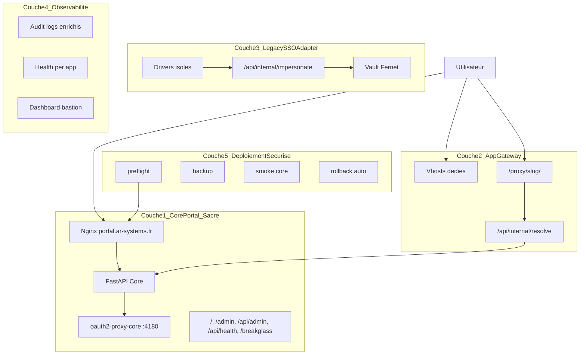
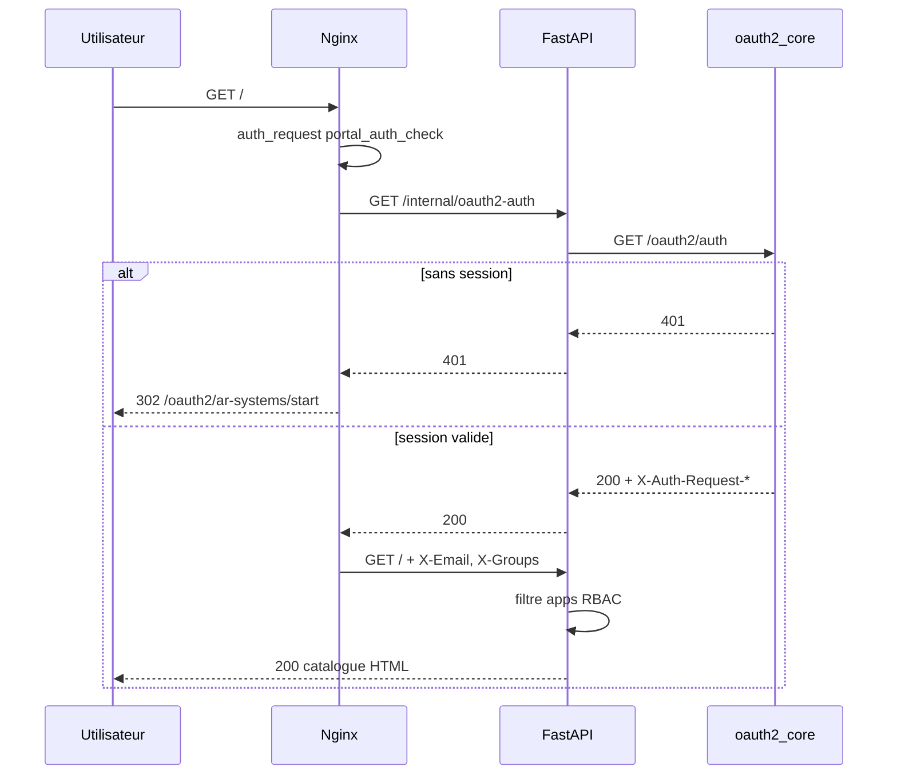
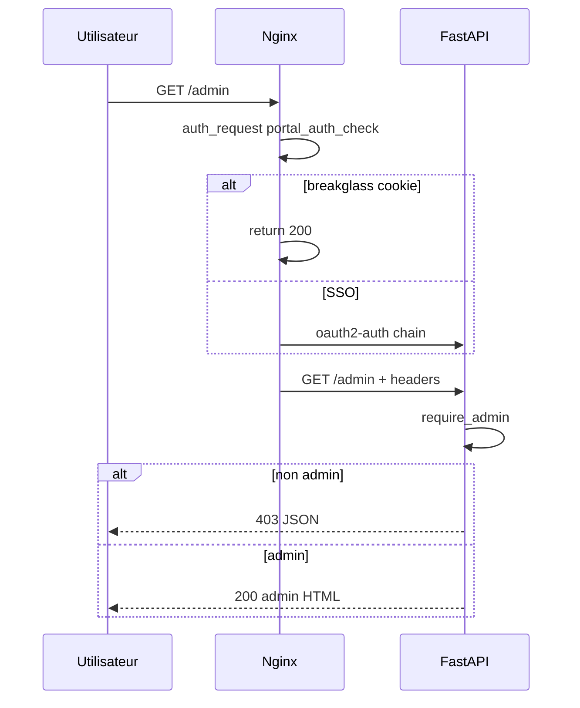
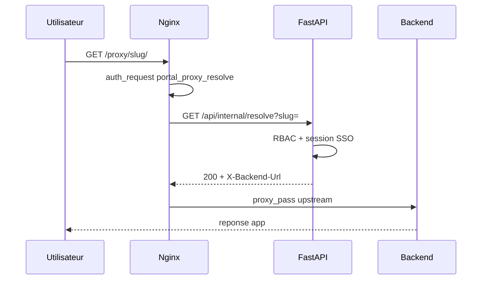

# Architecture bastion — Portail SSO AR-Systems

> **Statut :** document de référence produit (Phase 0).  
> **Périmètre :** évolution du portail vers un bastion applicatif — point d’entrée unique sécurisé.  
> **Normatif pour le Core :** [SDD portail SSO](sdd/README.md) — en cas de conflit sur auth/nginx/oauth2, les SDD prévalent.  
> **Plan d’implémentation :** [bastion-implementation-plan.md](bastion-implementation-plan.md).

**Hôte de production :** `vmdmz-reverse01` — `https://portal.ar-systems.fr`  
**Dépôt :** rôle `roles/sso_portal` dans `awx-playbook` (code applicatif — templates nginx bastion retirés, voir [SSO_PORTAL_BASTION_FEATURES_INVENTORY.md](SSO_PORTAL_BASTION_FEATURES_INVENTORY.md)).

> **Séparation DMZ (`e56fa58`)** : `linux_nginx_dmz.yml` = infra seule · `linux_sso_portal.yml` = portail.

---

## Sommaire

1. [Vision produit](#1-vision-produit)
2. [Phase 1 — Audit architecture existante](#2-phase-1--audit-architecture-existante)
3. [Phase 2 — Architecture cible en 5 couches](#3-phase-2--architecture-cible-en-5-couches)
4. [Phase 3 — Modèle de données cible (proposition)](#4-phase-3--modèle-de-données-cible-proposition)
5. [Phase 4 — Design des flux](#5-phase-4--design-des-flux)
6. [Phase 5 — Règles de sécurité](#6-phase-5--règles-de-sécurité)
7. [Phase 6 — UI admin bastion (cible)](#7-phase-6--ui-admin-bastion-cible)
8. [Annexes](#8-annexes)

---

## 1. Vision produit

Le portail AR-Systems devient le **point d’entrée unique et sécurisé** vers les applications internes et clientes. L’utilisateur ne voit qu’une origine HTTPS (`portal.ar-systems.fr`) ; les backends restent sur le réseau interne.

### Objectifs produit

| Objectif | Description |
|----------|-------------|
| Point d’entrée central | URL principale, catalogue filtré par droits, admin pour infra et supervision |
| Isolation des accès | SSO Keycloak, RBAC portail, apps invisibles sans droit ; admin indépendant des modules apps |
| Deux modes d’accès | **Lien sécurisé** (vhost dédié) ou **proxy transparent** (`/proxy/{slug}/`) |
| Robotic SSO | Vault applicatif Fernet + impersonation pour apps legacy sans OIDC |
| Sécurité bastion | Audit, rate limiting maîtrisé, health checks, preflight, rollback, Core sanctuarisé |

### Principe fondateur

> **Le Core Portal est sacré.** Aucune fonctionnalité applicative (proxy, vault, driver legacy) ne doit pouvoir casser l’accès à `/`, `/admin`, `/api/admin`, `/api/health`, `/breakglass` ou le flux SSO principal.

---

## 2. Phase 1 — Audit architecture existante

### 2.1 Authentification portail

#### Composants

| Composant | Rôle | Fichiers |
|-----------|------|----------|
| Nginx | TLS, `auth_request`, injection headers identité | `templates/nginx-portal.conf.j2` |
| FastAPI | UI, RBAC, délégation oauth2, résolution proxy | `files/portal/app/main.py` |
| oauth2-proxy-core | Session OIDC realm `ar-systems` | `:4180`, `oauth2-proxy-core.cfg.j2` |
| Keycloak | IdP OIDC | `keycloak.ar-systems.fr`, realm `AR-SYSTEMS` |

#### Chaîne auth_request (catalogue + admin)

```
Navigateur → Nginx auth_request /portal_auth_check
          → FastAPI GET /internal/oauth2-auth
          → oauth2-proxy GET /oauth2/auth (:4180)
          → 200 (session) ou 401 → @portal_oauth2_signin
          → 302 /oauth2/ar-systems/start?rd=...
```

| Élément | État actuel |
|---------|-------------|
| `/internal/oauth2-auth` | Retourne **uniquement 200 ou 401** vers Nginx (normalisation 5xx → 401) |
| Jeton interne | `X-Portal-Internal-Token` aligné `.env` ↔ snippet Nginx |
| Cookie session | `_kc_portal_ar`, domaine `portal.ar-systems.fr` |
| Callback OIDC | `https://portal.ar-systems.fr/oauth2/ar-systems/callback` |
| `/admin`, `/api/admin` | **Même** `auth_request /portal_auth_check` que `/` (pas de core-admin `:4190`) |
| Instances interdites | `:4181` legacy, `:4190` core-admin — désactivées (SDD-003) |

#### Break-glass

| Item | Détail |
|------|--------|
| Route | `GET/POST /breakglass` — LAN RFC1918 uniquement, **sans** `auth_request` |
| Cookie | `portal_breakglass_token` (JWT 8h) |
| Nginx | Présence cookie → `return 200` sur `portal_auth_check` ; validation JWT côté FastAPI |
| Post-login | Redirect `/admin` avec groupes admin injectés |
| Audit | Actions admin loguées via `log_audit()` |

#### Local admins

- Table `local_admins` : e-mail unique, `added_by`
- API : `/api/admin/local-admins`
- `UserContext.has_admin_access()` : break-glass, local_admin, groupes `portal_admin_groups`, recovery RFC1918

#### Realms OIDC

- Table `oidc_realms` : slug, `email_domains`, `oauth2_listen`, Keycloak client URLs
- Routage login : `/auth/sso-start`, `POST /auth/login` → `/oauth2/{slug}/start`
- Realm portail principal `ar-systems` : géré par Ansible (`oauth2_core_static_enabled`), **non** exporté par `apply-infrastructure`

#### Écarts / risques auth

| Risque | Impact | Mitigation existante |
|--------|--------|---------------------|
| Vhost non redéployé (hotfix manuel) | 500 `/admin` via `portal_core_auth_check` | SDD + deploy AWX |
| `TemplateResponse` API Starlette | 500 pages HTML post-upgrade deps | `render_template()` (commit récent) |
| RFC1918 bypass documenté wiki | Attente ≠ réalité Nginx | Recovery = break-glass ; SDD prévaut |

Référence détaillée : [auth-audit.md](auth-audit.md), [SDD-001](sdd/SDD-001-authentification-sso.md).

---

### 2.2 Gestion des applications

#### Modèle `applications` (état actuel)

**Découverte Nginx :** `server_name`, `canonical_url`, `source_file`, `upstreams`, `proxy_passes`, `config_hash`, `stale`, `last_seen_at`

**Catalogue / RBAC :**

| Champ | Type | Rôle |
|-------|------|------|
| `enabled` | bool | App active |
| `publish_in_portal` | bool | Tuile visible |
| `required_groups` | JSON list | Intersection avec groupes utilisateur |
| `maintenance_mode` | bool | Masque du catalogue |
| `display_name`, `description`, `logo_url`, `category`, `tags`, `owner` | | Présentation |

**SSO (concepts mélangés aujourd’hui) :**

| Champ | Valeurs | Rôle |
|-------|---------|------|
| `sso_mode` | `none`, `catalog`, `nginx_sso`, `dual_login` | Mode SSO catalogue / enforcement Nginx |
| `require_sso` | bool | Legacy, synchronisé depuis `sso_mode` |
| `legacy_local_login` | bool | Mode `dual_login` |
| `sso_bypass_rfc1918` | bool | Dry-run enforcement par app |

**Proxy transparent :**

| Champ | Rôle |
|-------|------|
| `proxy_enabled` | Active `/proxy/{proxy_slug}/` |
| `proxy_slug` | `[a-z0-9-]+`, unique |
| `internal_upstream` | URL backend (`http(s)://host`) |
| `proxy_upstream` | Alias legacy → `internal_upstream` |
| `proxy_authorization` | Header `Authorization` optionnel vers backend |
| `proxy_strip_prefix` | Retire `/proxy/{slug}/` (auto pour `wikijs`) |

**Absent aujourd’hui :** `access_mode`, `auth_mode`, `healthcheck_url`, `public_url`, `backend_type`, `robotic_driver`, IP allowlist par app.

#### Visibilité catalogue

`user_can_see_app()` : `enabled` ∧ `publish_in_portal` ∧ ¬`maintenance_mode` ∧ intersection `required_groups`.

#### Robotic SSO (état actuel)

- Réservé aux apps `proxy_enabled=true` avec entrée vault
- Driver **CrushFTP uniquement** (`impersonate_service.py`)
- Tuile client : `data-robotic-sso` + `data-proxy-slug`
- Flux : `/api/internal/impersonate/{slug}` → cookies scopés `/proxy/{slug}/` → redirect

Fichiers : `services.py`, `proxy_service.py`, `schemas.py` (`VhostPatch`).

---

### 2.3 Nginx

#### Vhost portail (`nginx-portal.conf.j2`)

| Classe | Chemins | auth_request |
|--------|---------|--------------|
| Public | `/health`, `/api/health`, `/static/`, `/favicon.ico`, `/auth/`, `/breakglass`, `/oauth2/*` | Non |
| Interne | `/portal_auth_check`, `/portal_proxy_resolve`, `@portal_oauth2_signin` | N/A |
| Protégé | `/`, `/admin`, `/api/admin`, `/logout` | `/portal_auth_check` |
| Proxy | `~ ^/proxy/{slug}/` | `/portal_proxy_resolve` |

**Rate limiting :**

| Zone | Application | Comportement |
|------|-------------|--------------|
| `portal_login` | `/logout`, `/breakglass`, `/auth/` | 3 r/s, burst 5–10 |
| `portal_api` | `/`, `/admin` | 30 r/s, burst 60 |
| `portal_proxy_pass` | `/proxy/`, resolve interne | 1000 r/s + **`limit_req_dry_run on`** |

**Sécurité :** HSTS, CSP stricte, `X-Frame-Options` (DENY sur `/admin`), WAF basique.

**Health :** `/_portal_nginx_ok` (loopback), `/health` → FastAPI avec jeton interne.

#### Vhosts applicatifs (`vhost-app.conf.j2`)

- Mode lien : proxy direct vers upstream, **pas** d’`auth_request` portail
- Déployés via `nginx_classic_app_vhosts` / enforcement `nginx_sso`

#### Proxy transparent (`proxy_portal_transparent.conf.j2`)

- `auth_request /portal_proxy_resolve` → `/api/internal/resolve?slug=`
- Headers backend : `X-Backend-Url`, `X-Backend-Host`, `X-Remote-User`, `X-Strip-Prefix`
- Filtrage cookies backend (CrushFTP : `CrushAuth`, `currentAuth`)
- `proxy_intercept_errors off` — erreurs confinées à `/proxy/`

#### Export dynamique

`/var/lib/sso-portal/exports/nginx-portal-realms.conf` — realms hors `ar-systems` core.

Référence : [SDD-002](sdd/SDD-002-nginx-vhost-portail.md).

---

### 2.4 Vault applicatif

#### Modèle `user_app_credentials`

| Champ | Rôle |
|-------|------|
| `user_email` | Identité SSO |
| `application_id` | FK `applications` (proxy uniquement) |
| `app_password_encrypted` | Fernet (clé `PORTAL_VAULT_FERNET_KEY`) |

Contrainte unique : `(user_email, application_id)`.

#### Chiffrement

- Clé persistante : `/var/lib/sso-portal/portal-vault-fernet.key` (Ansible, jamais régénérée au redeploy si existante)
- API admin : jamais de mot de passe en clair (`app_password_set` bool uniquement)
- Import JSON bulk : `/api/admin/user-app-credentials/import`

#### Impersonation

`GET /api/internal/impersonate/{slug}` :

1. Auth utilisateur (admin ou RBAC app)
2. Décryptage credential vault
3. Login backend CrushFTP (`/WebInterface/function/?command=login`)
4. Retour cookies → injection client scopée `/proxy/{slug}/`
5. Audit `impersonate`

#### Risques sécurité

| Risque | Mitigation actuelle | Cible bastion |
|--------|---------------------|---------------|
| Pollution cookies SSO vers backend | Filtrage Nginx + scope client | Règle stricte : pas de cookies portail vers upstream |
| Secret en log | Pas de log password | Maintenir + revue drivers |
| Driver unique | Échec CrushFTP = 502 | Registry drivers isolés (Lot 5) |
| Credential non testé | Aucun `last_test_*` | Champs + bouton test admin (Lot 6) |

---

### 2.5 Déploiement Ansible

#### Playbook

`linux_sso_portal.yml` : `preflight` → rôle `sso_portal` → `smoke_test`.

#### Templates statiques

| Fichier | Cible prod |
|---------|------------|
| `nginx-portal.conf.j2` | `/etc/nginx/conf.d/vhost_sso_portal.conf` |
| `oauth2-proxy-core.cfg.j2` | `/etc/oauth2-proxy-portal/core/` |
| `portal.env.j2` | `/opt/sso-portal/.env` |
| Snippets | `/etc/nginx/snippets/proxy_portal_*.conf` |

#### Génération dynamique (portail)

`infrastructure.py` + `apply-infrastructure.sh` :

- Configs oauth2 realms secondaires (`exports/oauth2/{slug}/`)
- `nginx-portal-realms.conf` (skip `ar-systems` si core statique)
- **Ne modifie pas** le vhost portail principal

#### Preflight existant (`tasks/preflight.yml`)

- Validation binaire oauth2-proxy sur configs temporaires
- Politique cookie (pas de `cookie_csrf_per_request`)
- `nginx -t` sur config **courante** (pas le vhost preview)

#### Rollback existant

| Mécanisme | Déclencheur |
|-----------|-------------|
| Backup vhost `.bkp` | Avant deploy |
| Rollback vhost | `nginx -t` post-deploy ou smoke `/api/health` KO |
| Smoke | oauth2 `/ping` + HTTPS `/api/health` |

#### Gaps preflight / SPOF

| Gap | Risque |
|-----|--------|
| Preview vhost non testé `nginx -t` | Deploy casse Nginx |
| Pas de check units `:4181`/`:4190` | Régression SSO |
| Rollback oauth2 cfg absent | SSO cassé, Nginx OK |
| Smoke sans `/` ni `/admin` 302 | Régression auth non détectée |
| apply-infra sans backup realms.conf | Export corrompu → reload Nginx KO |

**SPOF :** `vmdmz-reverse01` (Nginx + FastAPI + oauth2 core sur même hôte). Pas de Redis (sessions cookie oauth2-proxy uniquement).

Référence : [SDD-004](sdd/SDD-004-guardrails-deploiement.md).

---

## 3. Phase 2 — Architecture cible en 5 couches



### Couche 1 — Core Portal (sanctuarisé)

**Invariant :** routes et services ci-dessous ne dépendent **jamais** de la configuration d’une application catalogue ni d’un export `apply-infrastructure`.

| Route / service | Rôle |
|-----------------|------|
| `/`, `/admin`, `/api/admin/*` | Catalogue et administration |
| `/api/health` | Readiness DB + vault Fernet |
| `/health` | Liveness simple |
| `/breakglass` | Accès urgence LAN |
| `/internal/oauth2-auth` | Sous-requête Nginx auth |
| `/logout` | SLO Keycloak / break-glass |
| `oauth2-proxy-core` `:4180` | Session SSO unique portail + admin |

**Règle d’isolation :** code proxy/vault/drivers dans des modules séparés ; exceptions confinées ; handlers globaux sur routes HTML/API core.

### Couche 2 — App Gateway

| Mode | Accès utilisateur | Contrôle |
|------|-------------------|----------|
| Lien sécurisé | `https://app.ar-systems.fr` (vhost dédié) | SSO sur vhost (`nginx_sso`) ou OIDC natif app |
| Proxy transparent | `https://portal.ar-systems.fr/proxy/{slug}/` | `auth_request` → resolve → RBAC FastAPI |

Erreurs backend **ne remontent pas** au Core (snippet `proxy_intercept_errors off`, rate limit dry-run).

### Couche 3 — Legacy SSO Adapter

| Driver | Usage | Isolation |
|--------|-------|-----------|
| `crushftp` | Existant | Module dédié |
| `generic_basic` | HTTP Basic backend | À créer (Lot 5) |
| `generic_form` | POST login formulaire | À créer (Lot 5) |

Chaque driver : timeout, pas d’exception non gérée vers le handler global sans capture ; échec = réponse JSON claire, pas de retry infini.

### Couche 4 — Observabilité

- Audit enrichi (IP, UA, status) — proposition Phase 3
- Health par application (`healthcheck_url`, statut admin)
- Dashboard bastion : statut portail, auth, Keycloak, apps en erreur
- **Pas de Redis** dans l’architecture actuelle — le dashboard ne l’affichera pas sans décision explicite

### Couche 5 — Déploiement sécurisé

Pipeline : preflight → backup → deploy → smoke core → rollback si échec.

Le Core **doit rester accessible** après tout déploiement raté (rollback vhost + smoke `/api/health`).

---

## 4. Phase 3 — Modèle de données cible (proposition)

> **Non appliqué** — validation requise avant migration (Lot 3+).

### Application — champs proposés

| Champ cible | Type | Description |
|-------------|------|-------------|
| `access_mode` | enum | `link`, `nginx_sso`, `transparent_proxy` |
| `auth_mode` | enum | `none`, `oidc_native`, `oauth2_proxy`, `robotic_sso`, `basic_header` |
| `public_url` | string | URL tuile (lien direct) |
| `internal_upstream` | string | Backend proxy (existant) |
| `proxy_slug` | string | Slug proxy (existant) |
| `healthcheck_url` | string nullable | URL sonde (souvent `{upstream}/health`) |
| `healthcheck_expected_status` | int | Défaut 200 |
| `backend_type` | enum | `generic`, `crushftp`, `wikijs`, `grafana`, … |
| `strip_prefix` | bool | = `proxy_strip_prefix` |
| `preserve_host` | bool | Host header vers backend |
| `forward_cookies_mode` | enum | `none`, `safe`, `all` |
| `robotic_driver` | string nullable | `crushftp`, `generic_form`, … |
| `enabled`, `published` | bool | = `enabled`, `publish_in_portal` |
| `maintenance_mode` | bool | Existant |

### Mapping actuel → cible

| Cible | Actuel |
|-------|--------|
| `access_mode: link` | `sso_mode` ∈ {`none`,`catalog`}, `proxy_enabled=false` |
| `access_mode: nginx_sso` | `sso_mode=nginx_sso` |
| `access_mode: transparent_proxy` | `proxy_enabled=true` |
| `auth_mode: robotic_sso` | vault + tuile robotic (CrushFTP implicite) |
| `auth_mode: oauth2_proxy` | enforcement nginx + realm |

Migration : colonnes **nullable** + backfill script ; conserver anciens champs en lecture jusqu’à Lot 4.

### UserAppCredential — extensions proposées

| Champ | Rôle |
|-------|------|
| `last_tested_at` | Dernier test admin/impersonate |
| `last_test_status` | `ok`, `failed`, `unknown` |
| `updated_by` | E-mail admin ayant modifié |

### AuditLog — extensions proposées

| Champ | Rôle |
|-------|------|
| `ip` | IP client (`X-Real-IP`) |
| `user_agent` | UA navigateur |
| `status` | `success`, `failure` |
| `metadata_json` | Données structurées (complète `after_json` pour cas simples) |

Rétrocompat : API audit existante enrichie, champs nouveaux optionnels.

---

## 5. Phase 4 — Design des flux

### Flux A — Accès au portail



### Flux B — Accès admin



**Invariant :** aucun appel à `/api/internal/resolve`, vault ou driver dans ce flux.

### Flux C — App lien ou OIDC native

1. Utilisateur clique tuile → `public_url` ou `canonical_url`
2. Navigateur ouvre vhost dédié (`https://wikijs.ar-systems.fr`)
3. SSO : enforcement Nginx (`nginx_sso`) ou OIDC natif de l’app
4. Portail n’intervient pas dans la session app (sauf RBAC affichage tuile)

### Flux D — Proxy transparent



Erreurs 4xx/5xx backend : confinées à l’URL `/proxy/slug/` ; pas d’impact `/admin`.

### Flux E — Robotic SSO

1. Clic tuile legacy (`data-robotic-sso`)
2. `GET /api/internal/impersonate/{slug}` (auth + vault)
3. Driver login backend → cookies session app
4. Frontend injecte cookies **scopés** `/proxy/{slug}/`
5. Redirect `/proxy/{slug}/`
6. Échec : message utilisateur clair, **pas** de boucle retry infinie (max 1 retry 429 côté client existant)

---

## 6. Phase 5 — Règles de sécurité

### 6.1 Cookies

| Règle | Détail |
|-------|--------|
| MUST NOT | Transmettre cookies SSO portail (`_kc_portal_ar`) vers backends |
| MUST | Cookies backend scopés `/proxy/{slug}/` uniquement |
| MUST | Filtrage Nginx des cookies upstream (whitelist par app à terme) |
| MUST NOT | Pollution inter-apps (cookie app A visible sur app B) |

### 6.2 Rate limiting

| Chemin | Politique |
|--------|-----------|
| `/proxy/` | `limit_req_dry_run on` — pas de 429 bloquant utilisateurs authentifiés |
| `/api/internal/resolve` | Clé vide / dry-run — pas de blocage |
| `/api/internal/impersonate/` | Rate limit possible avec message JSON explicite |
| MUST NOT | 429 silencieux à corps vide sur flux authentifiés |

### 6.3 CSRF / OAuth

| Règle | Détail |
|-------|--------|
| MUST | Un seul oauth2-proxy core `:4180` pour `ar-systems` |
| MUST NOT | `cookie_csrf_per_request` |
| MUST | `rd` relatif uniquement (`portal_oauth2_rd_safe`) |
| SHOULD | Test smoke `Set-Cookie` CSRF sur `/oauth2/ar-systems/start` |

Aligné [SDD-003](sdd/SDD-003-oauth2-proxy-instances.md).

### 6.4 Break-glass

| Règle | Détail |
|-------|--------|
| MUST | `/breakglass` accessible LAN sans SSO |
| MUST | Validation JWT FastAPI (pas seulement Nginx) |
| MUST | Audit de chaque action admin en session break-glass |

### 6.5 Secrets

| Règle | Détail |
|-------|--------|
| MUST | Clé Fernet stable (`portal-vault-fernet.key`) |
| MUST NOT | Régénérer Fernet au redeploy AWX |
| MUST NOT | Logger mots de passe ou secrets oauth2 |
| MUST | Import JSON chiffré immédiatement en base |

---

## 7. Phase 6 — UI admin bastion (cible)

### État actuel vs cible

| Zone | Existant | Cible bastion |
|------|----------|---------------|
| Dashboard | Apps, realms, nginx stale, breakglass/RFC1918 | + statut auth, Keycloak ping, apps maintenance/erreur, échecs impersonation |
| Catalogue | Table vhosts, sync, dry-run | Filtres `access_mode`/`auth_mode`, boutons test upstream/auth/user |
| Vault | CRUD, import JSON, table | + test credential, export modèle, `last_test_*` |
| Audit | API seulement | UI recherche/filtres action/user/app/status |
| Packages Python | PyPI compare | Conservé (hors bastion strict) |

### Tableau de bord bastion (cible)

- Statut portail (`/api/health`)
- Statut auth (oauth2 `/ping`, dernière erreur auth_request)
- Statut Keycloak (discovery OIDC — optionnel)
- ~~Redis~~ — **N/A** (non présent dans le stack)
- Compteurs : apps publiées, maintenance, stale, erreurs proxy récentes (audit)

---

## 8. Annexes

### A. Routes Core sacrées (ne jamais casser)

```
/  /admin  /api/admin/*  /api/health  /health  /breakglass
/internal/oauth2-auth  /logout  /auth/*
/oauth2/ar-systems/*  /oauth2/static/*
/static/*  /favicon.ico
```

### B. Fichiers sources principaux

| Domaine | Chemin |
|---------|--------|
| FastAPI | `roles/sso_portal/files/portal/app/` |
| Templates HTML | `roles/sso_portal/files/portal/templates/` |
| Nginx portail | `roles/sso_portal/templates/nginx-portal.conf.j2` |
| Ansible tasks | `roles/sso_portal/tasks/` |
| Defaults | `roles/sso_portal/defaults/main.yml` |

### C. Documents liés

| Document | Rôle |
|----------|------|
| [bastion-implementation-plan.md](bastion-implementation-plan.md) | Lots, tests, Lot 1 |
| [sdd/README.md](sdd/README.md) | Invariants normatifs Core |
| [auth-audit.md](auth-audit.md) | Audit auth détaillé |
| [auth-test-plan.md](auth-test-plan.md) | Commandes validation |

### D. Problèmes actuels (synthèse)

1. Concepts `sso_mode` / `proxy_enabled` mélangés — besoin `access_mode` + `auth_mode`
2. Core logiquement isolé mais même processus FastAPI que proxy/vault
3. Robotic SSO monolithique (CrushFTP)
4. Pas de health per-app ni UI audit
5. Preflight/rollback incomplets pour vhost preview et oauth2 cfg
6. Wiki partiellement obsolète — SDD prévalent

---

*Document Phase 0 — généré pour validation avant toute modification runtime.*
